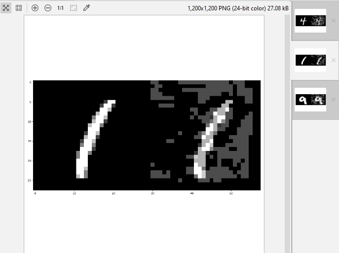

# Fast Gradient Sign Method (FGSM) on a MNIST Handwritten Digit Classification Model

Adversarial examples generated via the **FSGM** method are used on a handwritten digit classification model with accuracy of more than **98%**. 

This project consists of two main python modules: **train_model.py** and **attack_model.py**.  
 * In *train_model.py* a classification model will be trained on the [*MNIST handwritten digit database*](https://www.kaggle.com/c/digit-recognizer). The model will also be saved for future use.
 * In *attack_model.py* the trained model will be loaded and tested with adversarial examples generated with the *FGSM*.

## Prerequisites
 * Python: 3.7.4
    * Keras: 2.3.0
    * Tensorflow: 1.14.0
    * Cleverhans: 3.0.1

## Results


```
The normal validation accuracy is: 0.9992857142857143
The adversarial validation accuracy is: 0.20952380952380953
The prediction for the original number is: [4]
The prediction for the adversarial example is: [8]
The prediction for the original number is: [1]
The prediction for the adversarial example is: [8]
The prediction for the original number is: [9]
The prediction for the adversarial example is: [8]
```
